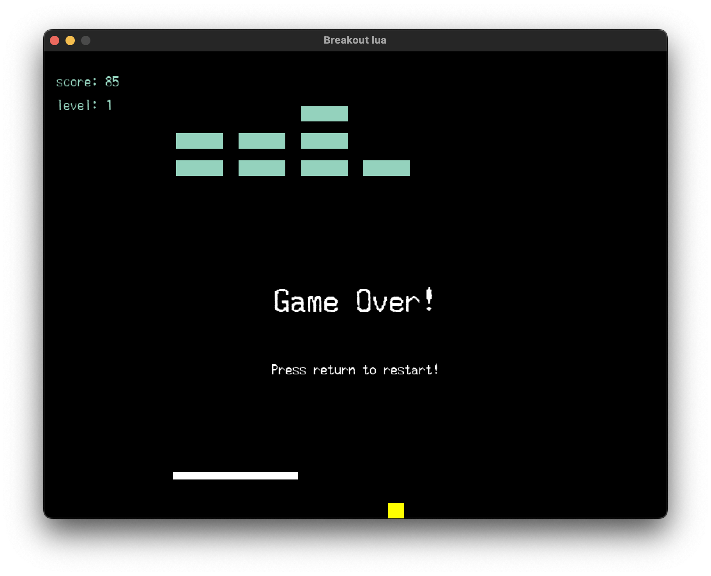

# Breakout lua
My intention with this game was to learn a little bit about lua. 
Heavily inspired by @tsoding approach of learning new languages



# Dependencies

- LOVE 11.4 [https://love2d.org/](https://love2d.org/)
- Lua 5.4.6 [http://www.lua.org/](http://www.lua.org/)

# Build the game
Just run the following command in the game folder

```
love ./
```
# Controls

- `a`, `d` or `<-` `->` - move the player
- `return` to start and restart the game
